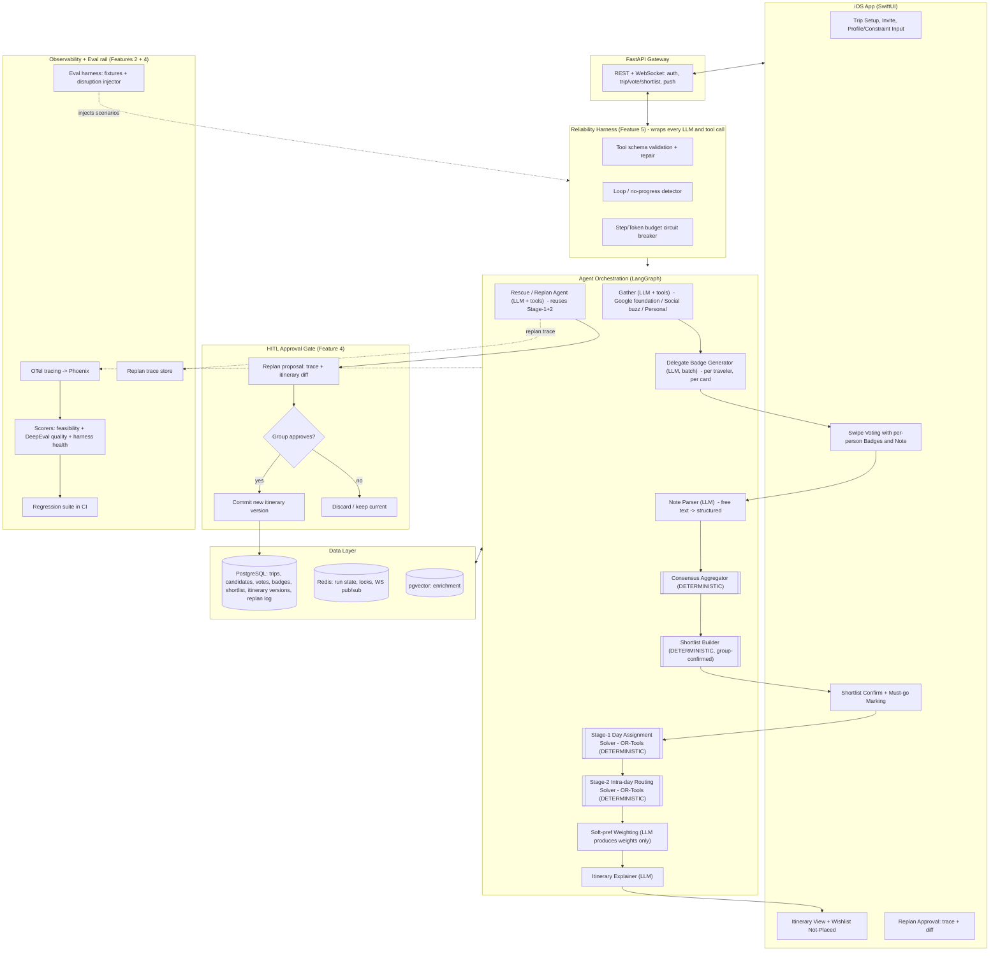

# Syncinerary — Group Travel Agent OS — CLAUDE.md v2

This file is the canonical build brief. Keep it at repo root so Claude Code auto-loads it. Read all of it before writing code, then follow the engineering order in Section 13 strictly.

If something here is ambiguous, stop and ask. Do not infer behavior that is not specified. The point of this document is to remove drift, not invite improvisation.

---

## 1. What we are building, and why

A group travel planning agent. The system gathers candidate places (attractions, food, lodging) from a balanced mix of sources, lets each group member swipe candidates with per-person hints, aggregates votes deterministically into a shortlist the group confirms, then runs a two-stage scheduler that decides which places go on which day and in what order, factoring weather, transit, fatigue, opening hours, and pinned anchors. When something disrupts the trip mid-execution, a rescue agent proposes a replan that the group must approve before it takes effect.

This is also a portfolio piece targeting AI Engineer roles. The headline is not "it plans a trip"; it is:

1. The LLM vs deterministic boundary is defensible.
2. The agent fails safely (Feature 5).
3. The agent does not act without group approval on consequential changes (Feature 4).
4. Every change can be measured against an eval set in five minutes (Feature 2).

Treat reliability and explainability as first-class product features, not afterthoughts.

---

## 2. The single most important architectural rule

**LLM handles fuzzy and explanatory work. Deterministic code handles feasibility and final decisions.**

| Job | Owner | Why |
|---|---|---|
| Discover, dedup, enrich candidates | LLM + tools | open-ended |
| Generate per-traveler badges on each card | LLM (delegate, batched) | natural language reasoning about a profile |
| Parse user free-text notes into structured metadata | LLM (delegate) | NLP |
| Compute group consensus score | Deterministic function | must be reproducible and auditable |
| Decide what enters the shortlist | Deterministic + human confirm | reproducibility + control |
| Satisfy hard scheduling constraints | OR-Tools CP-SAT | feasibility must be guaranteed |
| Weight soft preferences in the scheduler objective | LLM produces weights, solver uses them | trade-offs are subjective |
| Choose final itinerary | OR-Tools | must be defensible |
| Explain the itinerary in natural language | LLM | last step, never decides anything |

**Forbidden:** any LLM call inside `aggregate.py`, `shortlist.py`, `solver/`, `harness/`. If tempted, put the LLM step before or after those modules, not inside.

This rule is the single thing you must defend in interviews and code review. Do not break it.

---

## 3. The 6-step pipeline (user-facing flow, in order)

```
1. GATHER         Build a balanced candidate pool from 3 source types
2. SWIPE          Each traveler swipes; delegate badges show per-person hints
3. AGGREGATE      Deterministic consensus scoring across votes
4. SHORTLIST      Group confirms a smaller list, marks must-go
5. STAGE-1 DAYS   Solver decides: each shortlisted card -> day or not-placed
6. STAGE-2 ROUTE  Solver decides: per-day order, times, transit segments
7. EXPLAIN        LLM produces the itinerary narrative + wishlist-not-placed reasons
```

Step 7 numbering aside, this is six conceptual stages. Do not skip the shortlist confirmation; it is what gives users control and is a natural trace breakpoint.

---

## 4. Tech stack (decided, do not re-litigate)

| Choice | Rationale (also: interview answer) |
|---|---|
| Python 3.12 + FastAPI (async) | Agent ecosystem (LangGraph, Phoenix, DeepEval, OR-Tools, vendor SDKs) is Python-native; async fits I/O-bound LLM calls; pydantic-native |
| LangGraph | Stateful + replan loop + explicit control flow; LangChain is chain-only, CrewAI is role-play, AutoGen is conversational. Graph state machine fits |
| OR-Tools CP-SAT | Hard constraints must be guaranteed feasible. Scheduling is a classic CSP. LLM cannot guarantee feasibility or audit |
| Anthropic Claude via SDK | Model id from env var `SYNC_LLM_MODEL` (default `claude-opus-4-7`). Use `claude-haiku-4-5` for batch / cheap tasks via model router (add-on phase) |
| PostgreSQL + pgvector | Trip / vote / itinerary versions are highly relational. Embedding volume small (hundreds per trip), pgvector is enough |
| Redis | Run state, locks, WebSocket pub/sub. Short-lived high-write data does not belong in Postgres |
| Phoenix (self-hosted) for traces | OTel-native, trace data portable. LangSmith would couple to vendor cloud |
| OpenInference auto-instrumentation | Auto-instruments LangGraph node executions and Anthropic SDK calls into OTel spans. Raw `start_as_current_span` reserved for domain-level attributes only. Industry standard for AI observability in 2026 |
| DeepEval | pytest-native CI eval. Ragas is RAG-specific, ours is broader |
| pydantic everywhere | Required for Feature 5 tool validation. Pydantic schemas double as JSON schemas for LLM tool definitions |
| SwiftUI iOS | per user choice. REST + WebSocket to backend |
| Open-Meteo (weather) | Free, no key, 16-day forecast, Hokkaido covered |
| Google Directions API (transit) | Free tier sufficient for demo and tests, strong Japan transit coverage |

---

## 5. Architecture diagram



---

## 6. Repo structure

```
syncinerary/
  api/                    FastAPI app, routers, websocket handlers
  agents/                 LangGraph graph definition + nodes
    graph.py              wires nodes into a LangGraph StateGraph
    gather/
      live.py             Google Places foundation and pool composition
      social.py           Instagram, TikTok, and RedNote public metadata mining
      personal.py         user-paste + profile-driven (limited)
      dedup.py            cross-source entity resolution
      enrich.py           geocode, hours, photos, fatigue_cost tagging
    delegate/
      badge.py            per-traveler badge generation (LLM, batched)
      note_parser.py      free-text -> structured note metadata (LLM)
    aggregate.py          DETERMINISTIC consensus scoring     <- no LLM
    shortlist.py          DETERMINISTIC selection + must-go    <- no LLM
    solver/
      stage1_days.py      DETERMINISTIC OR-Tools day assignment
      stage2_route.py     DETERMINISTIC OR-Tools VRP-TW per day
      objective.py        weighted objective: dispersion, diversity, fatigue, etc
    softpref.py           LLM produces objective weights and hints only
    explain.py            LLM itinerary narrative + wishlist reasons
    rescue.py             replan agent: trace + diff producer
  harness/                Feature 5
    wrapper.py            single entry point for LLM/tool calls
    tool_guard.py         pydantic validation + repair loop
    loop_detector.py      state-hash + tool-arg cycle detection
    budget.py             step + token circuit breaker
  obs/                    OTel setup, span helpers, trace schema
  eval/                   Feature 2
    fixtures/             trip + disruption scenarios as JSON
    disruption.py         injectors for each trigger_type
    scorers.py            feasibility + quality + harness metrics
    runner.py             runs all, writes eval_result, diffs vs last run
  diff/                   itinerary diff + trace-to-text renderer (shared by F4)
  domain/                 pydantic models: TripState, CandidatePlace, Vote, Badge, Trace, etc
  store/                  postgres + redis repositories, alembic migrations
  tools/                  pluggable tool interface + implementations
    places/               Google Places, OSM
    transit/              Google Directions (with cache)
    weather/              Open-Meteo
    fetch/                Instagram, TikTok, RedNote metadata and screenshot OCR
  config/                 env defaults, model ids, thresholds
  tests/                  unit + integration; eval/ is separate from these
ios/                      SwiftUI app
docker/                   compose files for postgres, redis, phoenix
```

---

## 7. Data schema (Postgres)

Only the non-obvious columns are commented.

```
trip(
  id, destination, start_date, end_date,
  days INT,                        -- derived but stored
  status[setup|swiping|shortlisting|scheduling|active|disrupted],
  created_by
)

traveler(
  id, trip_id, name, home_city,
  profile_json                     -- structured preferences (dietary, mobility, interests)
)

constraint(
  id, trip_id,
  traveler_id NULLABLE,            -- NULL = group-level
  type,                            -- e.g. 'dietary', 'budget_daily', 'no_early_morning', 'must_be_at_place'
  value_json,
  priority INT,
  kind[hard|soft]
)

candidate_place(
  id, trip_id,
  type[attraction|food|lodging],
  name_canonical, name_original_lang,
  lat, lng, address, area,
  hours_by_weekday JSONB,          -- {mon: [[09,18]], tue: ..., ...}
  price_tier INT,                  -- 1..4
  duration_estimate_min INT,
  dietary_tags TEXT[],             -- ['vegetarian', 'halal']
  weather_dependent BOOL,
  reservation_required BOOL,
  fatigue_cost INT,                -- 1=low, 2=med, 3=high
  category TEXT,                   -- for diversity bonus: 'temple', 'museum', 'cafe', 'hike'
  sources JSONB,                   -- [{type:'discovery', subtype:'google_places'}, {type:'buzz', score:0.62}, {type:'personal', by:'traveler_id', via:'instagram_link'}]
  enrichment JSONB,                -- photos, top reviews, why-loved summary
  trending_signals JSONB,          -- mentions, recency_score, engagement
  embedding vector(1536)           -- for dedup similarity
)

candidate_badge(
  id, candidate_id, traveler_id,
  badge_type[warning|confirm|neutral],
  badge_text,                      -- short user-facing string
  reasoning,                       -- why this badge (for trace)
  generated_at
)

vote(
  id, candidate_id, traveler_id,
  signal[like|dislike|like_with_note|must_have],
  note_text TEXT NULLABLE,
  note_parsed JSONB NULLABLE       -- e.g. {self_handles_meal:true, alternative:'convenience_store'}
)

shortlist_state(
  trip_id PRIMARY KEY,
  selected_candidate_ids JSONB,    -- ordered
  must_go_candidate_ids JSONB,
  confirmed_by JSONB,              -- which travelers approved this shortlist
  confirmed_at,
  wishlist_excluded_ids JSONB      -- cards group voted up but did not make shortlist
)

itinerary_version(
  id, trip_id,
  version_no INT,
  status[proposed|active|superseded|rejected],
  created_by[agent|user],
  parent_version_id NULLABLE,
  created_at,
  objective_breakdown JSONB        -- per-objective scores for trace
)

itinerary_node(
  id, version_id, candidate_id,
  day INT,
  start_time, end_time,
  fixed BOOL,
  lock_reason TEXT,                -- 'user_pinned', 'reservation', 'check_in'
  transit_from_prev_min INT,
  transit_from_prev_mode TEXT,     -- 'walk', 'transit', 'taxi'
  notes_for_travelers JSONB        -- e.g. {traveler_id_A: 'self-handles meal'}
)

wishlist_not_placed(
  version_id, candidate_id,
  reason_code,                     -- 'no_day_fit', 'budget', 'fatigue_overflow', 'closed_on_available_days'
  reason_text
)

replan_event(
  id, trip_id,
  trigger_type[reservation_cancelled|transit_delay|overslept|place_closed|weather|other],
  trigger_payload JSONB,
  affected_node_ids JSONB,
  trace_json JSONB,                -- structured trace, see Section 12
  proposed_version_id NULLABLE,
  status[pending|approved|rejected],
  decided_by, decided_at
)

agent_run(
  id, trip_id, kind,
  status, step_count, token_cost,
  trace_id                         -- OTel trace id, joinable to Phoenix
)

eval_scenario(
  id, name,
  fixture_json,                    -- trip + travelers + constraints + candidate set
  disruption_json NULLABLE,
  expected_json                    -- assertions: must_include, must_exclude, score thresholds
)

eval_result(
  id, scenario_id, commit_sha,
  scores_json, passed BOOL,
  run_at
)
```

**Immutability rule:** `itinerary_version` and `itinerary_node` are append-only. A replan never updates an existing version; it creates a new one and points `parent_version_id` at the old one. F4 diff and F2 replay both depend on this.

---

## 8. Gather strategy: three inputs

The candidate pool combines a Google Places foundation, automatic social buzz,
and traveler attachments. Automatic social content comes from **Instagram,
TikTok, and RedNote only**. Reddit, YouTube, Wikivoyage, and Dcard are not data
sources for this product. Google Maps is used to verify real places and obtain
permitted place data, not as a social-content platform. Pool size defaults to
`days * 8`, within the acceptable range `days * 5` to `days * 8`.

### 8.1 Google Places foundation (~40%)

Destination-specific place searches provide enough attractions, food, and
lodging for complete days. Every returned address must match the selected city
before the place can enter the pool. The foundation is deterministic query
composition plus provider results, with no LLM free-association.

`sources[]` on a foundation candidate includes
`{type:'discovery', subtype:'google_places'}`.

### 8.2 Social discovery (up to ~60%)

What travelers are currently posting about on Instagram, TikTok, and RedNote.
Only official APIs or platform-permitted public metadata may be used.

**Method:**

1. Run one bounded high-intent search per platform and city. Instagram and
   TikTok searches target must-visit and must-eat posts. RedNote searches use
   Mandarin terms including `必去景点`, `必吃美食`, `旅游攻略`, and `探店`.
2. Run LLM NER over the public title and description snippets.
3. Geocode with Google Places and reject addresses outside the selected city.
4. One independent post may introduce a candidate. A place does not need to
   appear on multiple platforms or in three separate posts.
5. Rank explicit post likes and comments above search position when the public
   metadata labels those numbers. Otherwise use search position and mention
   count. Never treat account followers or account-wide likes as post
   engagement, and never invent unavailable engagement or recency values.
6. Merge a social match into the existing Google place instead of duplicating it.
7. Limit social cards to the configured buzz share of the automatic pool.
   When too few usable posts are found, fill the shortfall from Google Places.
8. Select the cards to verify from two lanes, not from one popularity sort.

`sources[]` includes `{type:'buzz', score:<value>, sources_count:<n>}`.

**Two-lane selection.** A pure popularity sort cannot surface a place that
suits this group but few people posted about, because such a place is
mentioned once by definition and ties with every other single-mention name.
Selection therefore fills a verification budget from two lanes:

| Lane | Ranked by | Answers |
|---|---|---|
| Trending | buzz score, then independent source count, then distinct creators | what has the strongest social evidence |
| For You | interest fit, then buzz as a tiebreak | what looks written for this group |

Rules:

- Discovery keeps every place a post names, including all ten from a listicle.
  Recall belongs to discovery; discrimination belongs to selection.
- A listicle cannot capture the deck because its ten places share one URL and
  therefore each carry `independent_source_count = 1`. Do not cap extraction
  per post, and do not discount a place for having come from a listicle.
- Interest fit is an ordinal 0 to 3 produced by the same NER call that reads
  the post, judged only from that post's own words. It is not a similarity
  float and needs no calibrated threshold. The model scores; deterministic
  code selects.
- A place is eligible for the For You lane at fit 2, a clear match.
- Unused slots in either lane backfill from the other, so a group that listed
  no interests gets a full trending deck rather than a short one.
- The trending lane breaks ties in favour of the LOWER interest fit, leaving
  interest matches for the lane that exists to carry them.
- Budgets derive from the pool the trip needs, not from a per-city cap: the
  pool is the same size whether the trip visits one city or four. Mining stays
  per city because a post about one city is not evidence about another.
- The chosen lane is stored on the card in `trending_signals.selection_lane`,
  so the UI reads the reason rather than recomputing it.

**What is read per platform.** Nothing permits a transcript of a reel or a
video, so "reading a post" means the text a platform publishes about it.

| Platform | Automatic discovery reads | A pasted link reads | Why not more |
|---|---|---|---|
| TikTok | The search snippet, plus the caption, creator, and cover frame from the official embed API (`tiktok.com/oembed`, no key). A cheap vision call transcribes the text on the cover frame | The same, with the cover frame read only when the caption names no place | Downloading the video or audio is not permitted |
| Instagram | The search snippet and explicitly labelled post engagement when present | The search snippet for that URL | Meta's public API does not provide arbitrary Reel discovery or metrics |
| RedNote | The search snippet and explicitly labelled post engagement when present | The search snippet for that URL | No general public note or comment API |

The read is bounded (`config/gather.py`): one batched read step and one
vision step per city, at most `SOCIAL_COVER_OCR_MAX_IMAGES` cover frames, post
metadata cached for a day and cover text for a week, and
`SOCIAL_COVER_OCR_ENABLED=False` turns the vision step off entirely. NER runs
over everything read and returns, per mention, a short highlight quoted from
that post; the highlight becomes the card's description and each post is kept
on the candidate as `enrichment.social_posts` (platform, URL, rank, creator,
highlight, and any explicitly labelled likes/comments) in evidence-rank order.

RedNote comment mining is permitted only when a future approved or licensed
source exposes the comments and their like counts. High-liked comments and
places repeated across those comments should then add evidence to the place,
but the prototype must not log in, scrape comment pages, or pretend that a
search snippet contains comment data.

### 8.3 Personal attachments

Two sub-sources.

**C1 User-paste:** Each traveler can paste an Instagram, TikTok, or RedNote
link. Screenshot extraction remains available at the API boundary when public
link metadata does not identify the place.
- Link: fetch public metadata + body text. Do not log in. Do not bypass paywalls. Do not scrape platforms that block scrapers; respect ToS.
- Screenshot: OCR + vision model entity extraction.
- Geocode extracted place names. Drop unresolvable extractions.
- Append to candidate pool with `sources[]` containing `{type:'personal', subtype:'user_paste', by:<traveler_id>, via:<platform>}`.
- Preserve whether the input was a link or screenshot and the contributing traveler. This provenance must survive dedup even when the same place is also found automatically.

Automatic discovery runs alongside user-paste. Instagram, TikTok, and RedNote
may participate only through configured official APIs or public metadata access
permitted by the platform. Never log in as a user, bypass access controls, or
scrape a platform that prohibits it.

**C2 Profile-driven:** From each traveler's `profile_json`, an LLM proposes a small number of candidates that match stated interests.
- Hard cap: max 2 candidates per traveler per trip.
- Mandatory sanity check: each candidate must pass geocoding via Google Places (real place) before entering the pool.
- `sources[]` contains `{type:'personal', subtype:'profile_driven', by:<traveler_id>}`.

### 8.4 Dedup with attribution

A place found by Google Places, social buzz, and a user-paste must collapse to
ONE candidate row whose `sources[]` retains every applicable entry.

Dedup pipeline:
1. Normalize names (translit, lowercase, strip suffixes).
2. Geographic cluster: candidates within 50m collapse.
3. Embedding similarity > 0.9 collapse (catches translation variants like "拉麵橫丁" vs "Ramen Yokocho" vs "さっぽろラーメン横丁").
4. LLM-assisted entity resolution as fallback for borderline cases.

When merging, keep the richest enrichment; union the `sources[]`.

### 8.5 Card UI source badges

Each card shows badges based on `sources[]`:
- 🗺️ Found on Google Maps (has discovery source)
- 🔥 Popular (has a social source with explicit post engagement)
- ↗ Found on Instagram / TikTok / RedNote (has a social source without
  explicit post engagement)
- ✨ For You (`trending_signals.selection_lane == 'for_you'`). Named for the
  mechanism that chose it, not "Hidden Gem": obscurity is not something the
  available data measures, and claiming it would be the same error as printing
  a like count that was never measured. It coexists with 🔥 / ↗ rather than
  replacing them, because provenance and selection reason are different facts.
- ❤️ Attached by you (has a user-paste source from the current viewer)
- 👥 Attached by group (has a user-paste source from another traveler; show the contributor's name in the accessible label and card details)

These badges are separate from delegate badges (Section 9). Source badges are about provenance; delegate badges are about per-person fit.

**Source links.** A badge whose provenance has a public URL is a link, so a
traveler can read the post the card came from instead of taking the badge on
trust. This is the difference between claiming a place is trending and showing
who said so.

| Badge | Opens | Read from |
|---|---|---|
| 🔥 Popular / ↗ Found on social | the post that named the place | `enrichment.social_post_urls`, labelled by `enrichment.social_platforms` |
| ❤️ Attached by you / 👥 Attached by group | the post that traveler shared | `enrichment.source_url` |
| 🗺️ Found on Google Maps | the place's Google Maps page | `enrichment.google_place_id` |

Rules:

- The badge opens the highest-ranked URL. When a buzz card has several posts
  behind it, the card details list all of them so the count on the badge can be
  checked against the posts it came from.
- A badge with no public URL stays plain text. Never synthesize a link, and
  never link to a search page in place of a missing post.
- Links open outward, in the platform's own app when it is installed and the
  system browser otherwise. The post is never rendered inside the app, its body
  is never fetched, and no login is ever presented. Linking out is what keeps
  this inside the platform terms in Section 15.
- Only URLs already normalized by the social URL parser are linkable, so a card
  cannot carry a tracking-parameter link or a URL from an unsupported host.
- The accessible label names the destination, for example "Popular on TikTok,
  opens the post".
- The same badges appear on itinerary stops, and the links behave identically
  there. "Why is this on my trip" is asked at least as often about a scheduled
  stop as about a swipe card.

Every swipe card includes a primary image when a permitted image is available. For a user attachment, prefer the submitted screenshot crop or a platform-provided public preview and label it as user-attached. For an automatically discovered place, use an attributed Google Places photo. If neither is permitted or available, show the standard place placeholder rather than hotlinking or copying a restricted image.

### 8.6 Three card types and how they enter the flow

| Type | Goes into swipe? | Pre-filter | Notes |
|---|---|---|---|
| Attraction | Yes | None | Standard |
| Food | Yes | Filter out candidates that violate any hard dietary constraint of any traveler before showing them in swipe | Avoids most noise in food cards |
| Lodging | **No** | N/A | Solver-driven. After shortlist confirmation, solver picks top 3 lodging options by area/budget/dates and shows a comparison; group picks one |

Transit is never a candidate. It is derived during Stage-2 routing (Section 11).

Google Places does not always publish dietary evidence. A food candidate with
an explicit tag that conflicts with a hard exclusion is removed. A candidate
with unknown dietary details stays in the deck with a reminder to confirm with
the restaurant. The app must not claim that unknown information is safe.

The lodging comparison may rank Places results by proximity and price tier,
and it shows the trip dates. It must not claim room availability until a
booking or availability provider is added.

---

## 9. Delegate badges + voting

### 9.1 Badge generation

For each card x each traveler, run a delegate LLM that produces ONE of:
- A `warning` badge if the candidate triggers any of the traveler's hard or high-priority soft constraints.
- A `confirm` badge if the candidate strongly matches a stated interest.
- **No badge** if neither (default; do not show empty badges).

Badge generation is **batched** before the user starts swiping, not on demand. Use the cheap model (Haiku-class via `SYNC_CHEAP_MODEL`) since this is high-volume and low-stakes per call. Budget the total cost via the harness.

A badge has two strings:
- `badge_text`: short, shown on the card (e.g. "Seafood-heavy, you marked vegetarian").
- `reasoning`: longer, stored for trace and viewable on tap.

**Delegate is not a decision-maker.** It does not vote, does not negotiate, does not exclude cards. It only annotates.

### 9.2 Voting UI: three buttons

Each card supports:
- 👎 Dislike — `signal=dislike`. Counts against consensus.
- 👍 Like — `signal=like`.
- 📝 Like with note — `signal=like_with_note`. Opens a text input. User types free text (e.g. "I can grab a convenience store meal").

There is also a long-press shortcut for `signal=must_have` (stronger than like). Reserve sparingly.

### 9.3 Note parsing

When a `like_with_note` is submitted, a delegate LLM (cheap model) parses the free text into structured `note_parsed` JSON. Recognized schemas:

- `{self_handles_meal: bool, alternative: string}`
- `{requires_short_visit: bool, max_minutes: int}`
- `{conditional_on: 'weather_good'|'time_of_day'|'group_consensus', ...}`
- Fallback: `{raw: string}` if no schema fits.

`note_parsed` flows downstream:
- Aggregator: `like_with_note` weighs the same as `like` for ranking. Conditions do not reduce weight.
- Solver: reads `note_parsed` for the relevant node and may add `notes_for_travelers` on the itinerary node.
- Explainer: surfaces the note in the narrative ("Traveler A will grab a convenience store meal here").

---

## 10. Aggregate + shortlist + must-go + wishlist

### 10.1 Aggregate

For each candidate, compute a single deterministic group score:

```
votes_pos       = count(like) + count(like_with_note)
votes_neg       = count(dislike)
votes_must      = count(must_have)
votes_total     = number of travelers

acceptance      = (votes_pos - votes_neg * dislike_weight) / votes_total
must_have_bonus = votes_must * must_have_weight
score           = acceptance + must_have_bonus
```

Default constants (in `config/aggregate.py`):
- `dislike_weight = 1.5`
- `must_have_weight = 0.3`

### 10.2 Shortlist builder

After voting closes, build a candidate shortlist:

```
target_size = days * slots_per_day            # default slots_per_day = 6
sort all candidates by score desc
take top target_size
```

Group sees this shortlist on a confirmation screen and may:
- Remove any card from the shortlist (drops back to wishlist).
- Add back any card from the just-below-threshold list.
- **Mark up to N cards as "must-go"** (default N = `days`). Must-go cards become hard pins for the Stage-1 solver.

Confirmation requires acknowledgment from at least 50% of travelers (configurable). On confirm, write `shortlist_state` and proceed to Stage-1.

### 10.3 Wishlist not-placed

Cards that made the shortlist but the solver could not place are surfaced alongside the final itinerary in `wishlist_not_placed` with a `reason_code`. The Explainer turns these into human-readable lines ("Otaru Music Box Museum did not fit because Day 4 was already at the fatigue cap").

This is a key UX feature: it answers "why did my favorite not get included?" up front, which prevents a class of user frustration and is a natural trace surface.

---

## 11. Two-stage solver

### 11.1 Stage 1 — Day Assignment

**Decision variables:** for each shortlisted candidate, `day in {0, 1, ..., days-1, NOT_PLACED}`.

**Hard constraints:**
- Must-go candidates must have `day != NOT_PLACED`.
- User-pinned anchors: assigned to their pinned day.
- Open-day constraint: candidate must be open on the assigned day (uses `hours_by_weekday` + day-of-week of the trip dates).
- Activity date constraints: candidates with a specific date (events) pinned.
- Daily fatigue budget: `sum(fatigue_cost) <= daily_fatigue_budget` per day (default 8).
- Daily walking budget: rough heuristic in Stage 1 (default 90 min/day), refined in Stage 2.
- Lodging anchor: if a lodging is selected for the trip, each day starts and ends within its area unless explicitly multi-base.

**Soft objective (weighted sum; weights from `softpref.py`):**
- Geographic clustering: minimize sum of pairwise distances within a day.
- Diversity: avoid placing too many candidates of the same `category` on one day.
- Weather match: prefer outdoor on dry days, indoor on rainy days (uses Open-Meteo forecast).
- Vote score: prefer placing high-score candidates over low-score ones (NOT_PLACED has a penalty proportional to the candidate's vote score).
- Conditional preferences from `note_parsed`: e.g. respect "only if weather is good".

### 11.2 Stage 2 — Intra-day Routing

Run independently for each day. Input: the candidates assigned to that day in Stage 1, plus any anchors.

**Decision variables:** order of visit + start_time/end_time per candidate.

**Hard constraints:**
- Opening hours per candidate.
- Reservation anchors (must be visited within reservation window).
- Lodging anchors (start of day, end of day).
- Transit time: cannot start a visit before `prev_end_time + transit_minutes(prev, this)`.
- Total day duration cap (default 12 hours active).

**Soft objective:**
- Minimize total transit time.
- Prefer morning slots for crowd-sensitive places when LLM has flagged them (heuristic from reviews; not a hard constraint, see Section 15 on why crowds are not in hard constraints).
- Match meal categories to meal times.

**Transit lookup:**
- Pre-fetch all pairwise transit times among the day's candidates via Google Directions API.
- Cache aggressively: cache key is `(origin_place_id, dest_place_id, mode, departure_window)`.
- For a `days=5, shortlist=30` trip with 6 candidates per day, lookups are O(n^2) per day = 36 calls per day = ~180 calls per trip. Well within free tier.

### 11.3 Independent replan property

Because Stage 2 runs per-day, F4 can replan a single day without touching the rest of the trip. This is a deliberate design choice.

---

## 12. The three core features

### 12.1 Feature 5 — Reliability harness (foundational, ships in Prototype)

Every LLM call and every tool call in the codebase goes through `harness/wrapper.py`. There are no exceptions. PRs that bypass it must be rejected in review.

The wrapper provides:

1. **Tool schema validation + repair** (`tool_guard.py`)
   - Validates tool input arguments against the tool's pydantic schema before execution.
   - On validation failure, re-prompts the model once with the validation error appended to the conversation, asking for corrected arguments.
   - Repair attempt cap: 2. Then raises `ToolCallUnrecoverable`.
   - All attempts logged to the span.

2. **Loop / no-progress detection** (`loop_detector.py`)
   - Maintains a rolling window of state hashes (over the LangGraph state slice that matters for the current node).
   - If the same state hash appears 3 times within a window of N steps, raise `NoProgress`.
   - If the same tool is called with equivalent arguments 3 times within a window, raise `ToolCycle`.

3. **Step + token budget circuit breaker** (`budget.py`)
   - Per-run caps from env: `SYNC_MAX_STEPS`, `SYNC_MAX_TOKENS_USD`.
   - On exceed, raise `BudgetExceeded`. Persist the partial trace.

**Acceptance criteria for F5:**
- Test: a tool stub raises a validation error on first call but accepts on second; the harness must repair and succeed within attempt cap.
- Test: a stubbed agent enters a 2-step cycle; loop detector must raise `NoProgress` before the step cap.
- Test: token budget set tiny; run aborts with `BudgetExceeded` and a partial trace exists in storage.
- Audit: no agent or tool module imports the LLM SDK directly. Grep CI check enforces this.

### 12.2 Feature 4 — Replan with explainable trace + HITL approval gate

Triggered when a disruption is reported (manually via API for now; real-time ingestion is add-on phase).

`rescue.py` must:

1. Identify all `itinerary_node` rows affected by the trigger.
2. For each affected node, classify as `fixed` (reservation, paid ticket, flight, check-in) or `movable`.
3. For movable nodes, query for alternatives via the gather tool stack, scoped to: nearby (area), open at the needed time, satisfying the same hard constraints, with vote score from the original pool if available.
4. Re-run Stage-1 (for the affected day only) + Stage-2 (for that day) producing a candidate `itinerary_version` with `status='proposed'` and `parent_version_id` set.
5. Emit a structured trace JSON:

```json
{
  "trigger": {"type": "reservation_cancelled", "node_id": "...", "at": "..."},
  "affected_nodes": [{"node_id": "...", "candidate_id": "...", "classification": "movable"}],
  "alternatives_considered": [
    {"candidate_id": "...", "score": 0.72, "rejected_reason": "violates fatigue cap"},
    {"candidate_id": "...", "score": 0.65, "chosen": true, "reason": "lowest transit + within budget"}
  ],
  "downstream_changes": [{"node_id": "...", "old_time": "...", "new_time": "..."}]
}
```

6. Push the proposal to the group via WebSocket. **Never auto-commit.**
7. On approve: set proposed `active`, the prior version `superseded`. On reject: keep current; mark proposed `rejected`.
8. Every decision recorded in `replan_event` with `decided_by`, `decided_at`.

**The diff:** `diff/itinerary_diff.py` returns `{added, removed, moved, time_changed}` between two versions. iOS renders this.

**Acceptance criteria for F4:**
- Marking a disruption creates a proposed version + pending replan_event; active version unchanged.
- Trace lists at least one quantified reason (transit, fatigue, or budget) on the chosen alternative.
- Approve transitions versions; reject does not; both logged.
- Diff endpoint returns added/removed/moved/time-changed for any two versions.
- Replan a 5-day trip in under 10 seconds (excluding API latency to external tools).

### 12.3 Feature 2 — Eval harness (built last, but is the interview headline)

Closes the trace -> eval -> fix loop. Should answer "did this change make the agent better or worse" within 5 minutes of running.

**Structure:**

`eval/fixtures/` — at minimum 10 fixtures:
- `clean_5day_hokkaido.json` — baseline
- `vegetarian_conflict.json` — at least one hard dietary conflict
- `budget_tight.json` — daily budget bites
- `weather_storm_day3.json` — outdoor-heavy day 3 with rain forecast
- 5 disruption fixtures, one per `trigger_type` in F4
- `group_split.json` — two factions with opposing preferences

`eval/disruption.py` — injectors for each `trigger_type`.

`eval/scorers.py` — three families:

| Family | Examples | Pass/Fail or scored |
|---|---|---|
| Feasibility (deterministic) | No hard constraint violated; all reservations honored; transit fits; fatigue under cap | Pass/Fail; any failure fails the eval |
| Quality (DeepEval + custom) | Explanation faithfulness vs chosen itinerary; consensus fairness (worst-off traveler satisfaction); coverage of must-go | Scored, regression-tracked |
| Harness health | No run exceeded budget; no unrecovered tool-call failure; no `NoProgress` raised on benign fixtures | Pass/Fail |

`eval/runner.py` — runs all fixtures, writes `eval_result` rows tagged with git commit SHA, prints per-fixture scores and an aggregate diff vs the previous commit's run.

**Acceptance criteria for F2:**
- `python -m eval.runner` runs all fixtures and prints scores + diff vs last commit.
- A deliberately bad change (e.g. disabling the fatigue cap) shows a measurable regression in the output.
- CI fails the PR if any feasibility scorer regresses.
- 5-minute end-to-end runtime for the full eval suite on a developer laptop.

---

## 13. Engineering order: Prototype → Production → Add-on

Strict ordering. Do not skip ahead. Each milestone has acceptance gates (Section 12 + this section).

### Phase A — Prototype (M0 to M2)

Goal: one end-to-end trip plans through all 6 pipeline stages with simplified components. Demo-able even if rough.

**M0. Scaffold and observability skeleton**
- Repo structure as Section 6.
- docker-compose for Postgres + pgvector, Redis, Phoenix.
- All pydantic domain models in `domain/`.
- Empty LangGraph graph that emits OTel spans visible in Phoenix.
- iOS app skeleton (placeholder screens, networking layer).
- **Done when:** an empty graph run produces a trace in Phoenix; iOS connects to backend health endpoint.

**M1. Thin vertical slice**
- Gather: ONE source only. Use a hardcoded JSON fixture for the destination's candidates. Skip the full source mix for now.
- Swipe: two buttons (like/dislike only). No badges yet.
- Aggregate: deterministic acceptance score (Section 10.1, ignoring must_have).
- Shortlist: simple top-N, no confirmation screen yet; auto-proceeds.
- Solver: a single-stage OR-Tools that uses only hours + transit (via Google Directions). Skip weather, fatigue, diversity, dispersion for now.
- Explain: short LLM narrative.
- iOS: trip create, swipe, itinerary view. No replan, no shortlist screen, no badges.
- **Done when:** one user can create a Hokkaido 5-day trip, swipe ~30 candidates, get an itinerary back end-to-end.

**M2. Feature 5 — Reliability harness**
- Wrap every existing LLM/tool call in `harness/wrapper.py`.
- Implement `tool_guard`, `loop_detector`, `budget`.
- Add the grep CI check for direct SDK imports.
- **Done when:** F5 acceptance criteria met. M1 still works through the harness.

### Phase B — Production (成品) (M3 to M7)

Goal: ship the real product including the three interview-headline features.

**M3. Full gather strategy**
- Let travelers type up to four cities in one country, with at least one trip day per city.
- Implement a city-scoped Google Places foundation for attractions, food, and lodging.
- Implement Instagram, TikTok, and RedNote content-first discovery. One post
  may introduce a place; explicit post engagement and repeated mentions rank
  it higher when available.
- Implement personal user-paste for those same three platforms and contributor provenance.
- Implement profile-driven suggestions, capped at 2 per traveler and verified through Google Places.
- Remove food with explicit hard-diet conflicts and warn when dietary details are unknown.
- Compare up to 3 lodging options and persist the group's selection as a hard solver anchor.
- Run automatic discovery alongside user attachments. Social discovery must use configured official APIs or platform-permitted public metadata access.
- Implement cross-source dedup with attribution.
- Card UI primary images and explicit source badges (📍 🔥 ❤️ 👥), including who attached user-submitted content.
- **Done when:** the selected cities produce a complete Google foundation plus eligible social and personal cards with correct attribution; dedup tests pass; no candidate falls outside its resolved city; cities receive consecutive itinerary days; every user-attached card identifies its contributor and input type; cards render an attributed permitted image or the standard placeholder.

**M4. Delegate badges + 3-button voting + note parsing + shortlist screen**
- Batched badge generation per traveler per card (cheap model).
- Three-button swipe UI in iOS (like / dislike / like_with_note).
- Long-press for must_have signal.
- Note parser LLM + structured `note_parsed`.
- Shortlist confirmation screen with must-go marking.
- Wishlist-excluded tracking.
- **Done when:** a multi-traveler test trip shows different badges per traveler on the same card; a `like_with_note` produces correct `note_parsed`; shortlist confirmation cycle works including must-go marking and quorum.

**M5. Full two-stage solver**
- Stage 1: day assignment with all constraints (weather via Open-Meteo, fatigue, diversity, dispersion, user-pinned, must-go).
- Stage 2: intra-day routing with transit cache.
- `softpref.py` produces objective weights.
- Explainer narrative + wishlist-not-placed reasons.
- **Done when:** the same shortlist plans differently under three different weather scenarios (sunny / rainy / mixed); user-pinned anchors honored; wishlist surfaces with quantified reasons.

**M5a. Source links on cards**

Sits between M5 and M6 rather than renumbering the milestones after it. It is
small, and it is placed after M5 because the itinerary rows it also applies to
only exist once the two-stage solver ships.

- Every source badge that has a public origin URL becomes a link (Section 8.5).
- The badge payload carries an optional URL and a platform label; a badge
  without one is rendered as plain text.
- Buzz cards list every post behind them in the card details, not just the one
  the badge opens.
- Same behavior on the swipe deck and on itinerary stops.
- **Done when:** a buzz card opens the Instagram, TikTok, or RedNote post that
  named it; a card a traveler attached opens the post they shared; a card found
  only by place search opens its Google Maps page; a card with no public URL
  shows its badge with no link and no placeholder; and no link path fetches a
  post body or presents a login.

**M6. Feature 4 — Replan + HITL approval gate**
- Disruption marking endpoint per `trigger_type`.
- Rescue agent.
- Trace JSON + diff renderer.
- WebSocket push for proposals.
- iOS approval screen with diff visualization.
- **Done when:** F4 acceptance criteria met for all 5 trigger types.

**M7. Feature 2 — Eval harness**
- 10 fixtures.
- Disruption injectors.
- Three scorer families.
- Runner + CI integration.
- **Done when:** F2 acceptance criteria met; CI runs eval on every PR; a deliberately bad change shows measurable regression in CI output.

The default run makes no model calls. Two acceptance criteria pull against
LLM-judged metrics: five minutes end to end, and CI on every pull request. A
judge adds latency, a per-PR bill, and non-determinism to the very signal
being measured, so every scorer that gates CI is deterministic and the
narrative is checked for groundedness rather than judged. The model-judged
path lives behind `--with-llm` and the `eval-llm` extra. This is the section
2 boundary applied to the harness itself: the model writes, deterministic
code decides whether the run passed.

### Phase C — Add-on (M8+)

Optional features to demonstrate additional senior signals. Pick based on interview prep priorities. Recommended order if doing more than one: M8, M9, M10.

**M8. Prompt versioning**
- Extract all prompts into `prompts/` with version numbers.
- Every LLM call logs which prompt version it used (in the span).
- A/B test infrastructure for prompt changes.
- Interview value: high. Common question and easy to demo.

**M9. Streaming**
- Stream the explainer narrative to iOS. Big UX win, common interview question.

**M10. Model router**
- Cheap model (Haiku-class) for badge generation, NER, note parsing.
- Expensive model for explainer, rescue.
- Router in `harness/wrapper.py` decides based on task tag.
- Note: M4 already nominally uses the cheap model env var; M10 makes the routing rigorous and tracked.

**M11. Enhanced profile-driven gather (C2 expansion)**
- Increase cap, add stronger sanity checks, vision-based interest detection from user photos.

**M12. Cross-trip personalization memory**
- A traveler's preference profile improves across trips.

**M13. Real-time disruption ingestion**
- Wire in a transit API for live delays. Trigger F4 automatically.

**M14. Safety / PII guardrail layer**
- Output filter in the harness for PII leakage. Governance demo material.

---

## 14. Conventions + definition of done

- Every tool input and output is a pydantic model. No untyped dicts crossing a node boundary in the LangGraph state.
- Every LLM and tool call goes through `harness/wrapper.py`. CI check enforces this.
- LangGraph node execution spans and Anthropic SDK call spans are auto-instrumented via OpenInference. Manual `tracer.start_as_current_span` is reserved for domain-level spans (cross-node phases, trip-scoped operations) that add attributes not derivable from auto-instrumentation. Spans carry `trip_id`, `run_id`, `model_id`, `prompt_version` (when M8 lands), and the result tag.
- LangGraph nodes receive the typed state and return a partial dict for the graph to merge in. Never mutate the input state in place: in-place mutation breaks LangGraph's checkpointer serialization for pydantic-BaseModel state.
- FastAPI startup and shutdown use the `lifespan` async context manager. Do not use `@app.on_event`, deprecated in FastAPI 0.100+.
- No LLM inside `aggregate.py`, `shortlist.py`, `solver/`, `harness/`.
- `itinerary_version` is append-only.
- Prose in docs, commits, code comments: no em dashes. Use commas, colons, parens, or restructure.
- A feature is "done" only when every acceptance criterion has a passing test.
- All commits include a one-line rationale for non-obvious decisions ("chose CP-SAT over LP because ...").

---

## 15. Out of scope

Do not build these without explicit instruction; if needed, surface in a discussion before writing code.

- Real booking or payment execution.
- Unauthorized scraping of Xiaohongshu, Instagram, or TikTok, including login automation, access-control bypass, or collection that violates platform terms. Configured official APIs and platform-permitted public metadata access are allowed.
- Popular Times / crowd estimation as a hard solver constraint. Reason: data sources are unreliable and silently biased. The system instead uses LLM-extracted heuristic flags from reviews ("crowds often mentioned") as soft hints to Stage 2 only.
- Multi-trip personalization memory across trips (deferred to M12).
- Mobile push notifications beyond the in-app WebSocket.
- Auth providers beyond a stub identity service.
- LLM-driven natural language input as a primary entry point. The product is structured input + swipe, not "chat with your travel agent."

---

## 16. Decisions I committed to (override list)

These defaults were set without explicit confirmation. If any are wrong, change them here BEFORE coding starts. After M2 they become structural and harder to change.

| Default | Value | Where it lives |
|---|---|---|
| Automatic source mix | Up to 60% social buzz / Google foundation fills the remainder; personal attachments are additive | `config/gather.py` |
| Candidate pool size | `days * 8` (acceptable range: `days * 5` to `days * 8`) | `config/gather.py` |
| First-round mined names | 100 per trip | `config/gather.py` |
| Verification budget ceiling | 40 Places checks per trip | `config/gather.py` |
| Expected verification yield | 0.75 | `config/gather.py` |
| Trending lane share | 70% of the verification budget | `config/gather.py` |
| For You minimum interest fit | 2 of 3 | `config/gather.py` |
| Social min source count | 1 | `config/gather.py` |
| C2 profile-driven cap | 2 candidates per traveler | `config/gather.py` |
| Social platforms | Instagram / TikTok / RedNote only | `agents/gather/social.py` |
| Slots per day for shortlist target | 6 | `config/aggregate.py` |
| Must-go cap | `days` cards | `config/aggregate.py` |
| Dislike weight in aggregator | 1.5x | `config/aggregate.py` |
| Must-have weight in aggregator | 0.3 | `config/aggregate.py` |
| Shortlist confirm quorum | 50% of travelers | `config/aggregate.py` |
| Daily fatigue budget | 8 (low=1/med=2/high=3) | `config/solver.py` |
| Walking minutes per day | 90 | `config/solver.py` |
| Day duration cap | 12 hours active | `config/solver.py` |
| LLM default model | `claude-opus-4-7` | env `SYNC_LLM_MODEL` |
| LLM cheap model | `claude-haiku-4-5` | env `SYNC_CHEAP_MODEL` |
| LLM standard input price | $5 per million tokens | env `SYNC_LLM_INPUT_USD_PER_MILLION` |
| LLM standard output price | $25 per million tokens | env `SYNC_LLM_OUTPUT_USD_PER_MILLION` |
| Harness step cap | 50 external calls per run | env `SYNC_MAX_STEPS` |
| Harness model-cost cap | $2 per run | env `SYNC_MAX_TOKENS_USD` |
| Repair attempt cap | 2 | `config/harness.py` |
| Loop hash repeat threshold | 3 | `config/harness.py` |
| Weather source | Open-Meteo | `tools/weather/` |
| Transit source | Google Directions API | `tools/transit/` |

---

## 17. Glossary

- **Foundation:** city-matched Google Places candidates that keep the pool usable.
- **Buzz:** candidates named by Instagram, TikTok, or RedNote posts. Explicit
  post engagement and repeated mentions strengthen ranking but are not an
  eligibility requirement.
- **Personal:** candidates from user paste (C1) or driven by the traveler's profile (C2).
- **Delegate:** a per-traveler LLM context that produces badges and parses notes for THAT traveler only. Does not negotiate. Does not vote. Does not decide.
- **Shortlist:** the group-confirmed subset of candidates that proceeds to scheduling.
- **Must-go:** a shortlist-stage hard pin. Solver must place this card.
- **Stage 1:** day assignment.
- **Stage 2:** intra-day order, times, and transit.
- **Anchor:** a node the solver cannot move (reservation, check-in, user-pinned).
- **Wishlist not-placed:** shortlisted cards the solver could not fit, surfaced with reasons.
- **Trace:** structured JSON record of decisions an agent made; persisted for replan (F4) and eval (F2).
- **Source badge:** the 🗺️ 🔥 ❤️ 👥 icons on a card indicating provenance (Google discovery / buzz / your personal / group personal). Separate from delegate badge.
- **Source link:** the outward link on a source badge that opens the post or place page the card came from. Present only when the provenance carries a public URL.
- **Delegate badge:** the per-person warning or confirm chip on a card.

---

## 18. Installed agent skills

External skills installed for this project. They provide general best
practices; CLAUDE.md rules take precedence when they conflict.

- `swiftui-pro`: consult for all SwiftUI work in ios/. Modern API usage,
  deprecation avoidance, view performance.
- `ios-design-taste`: consult before designing or restyling any screen in
  ios/. Names the templated "AI look" to avoid, requires a written design
  plan and a critique pass before code, and holds the copy rules.
- `supabase-postgres-best-practices`: consult when writing migrations,
  designing indexes, or configuring connection pooling.
- `redis-core`: consult when designing Redis key schemas for run state
  and WebSocket pub/sub.
- `langgraph-fundamentals`: consult for all LangGraph state, node, edge,
  routing, streaming, and error-handling work.
- `langgraph-persistence`: consult for checkpointer setup, thread IDs,
  checkpoint history, and persistent graph state.
- `langgraph-human-in-the-loop`: consult for graph interrupts, resume
  semantics, approval flows, and idempotency around interrupt boundaries.
- `deepeval`: consult when implementing M7 eval datasets, pytest eval suites,
  metrics, or the run-inspect-iterate evaluation loop.
- `test-driven-development`: use for behavior changes and bug fixes, with the
  repository's pytest commands and acceptance criteria taking precedence.
- `code-review-and-quality`: use before merging changes to review correctness,
  architecture, security, performance, tests, and verification evidence.

Precedence: CLAUDE.md §2 (LLM vs deterministic boundary), §14 (conventions),
and §16 (defaults) override any external skill guidance. If a skill suggests
something that conflicts with those sections, follow CLAUDE.md and note the
conflict in your response.

End of CLAUDE.md v2. If you are about to start coding and any section above feels ambiguous, stop and ask.
